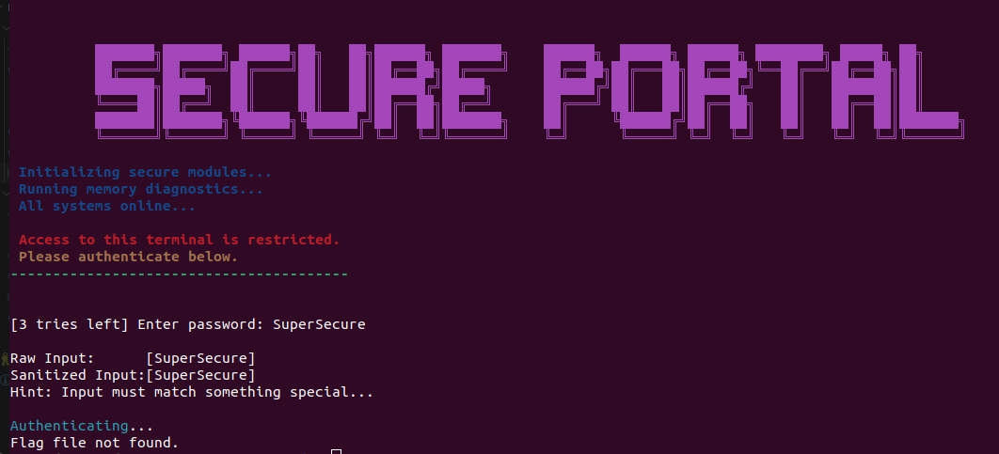

# Write-up Bypass Me

## Challenge

This challenge provided a binary file in which the user had to input the right password for the flag to be revealed.

### 1. Putting the file in a decompiler

I inserted the binary file in a decmompiler. I used [Decompiler Express](https://dogbolt.org/).

I worked with two decompilers: Ghydra & Binary Ninja. The output of each decompiler is included in the folder.

### 2. Finding the right value to extract

The important variable is `char password [128];`. It is then passed to the decode_password function: `decode_password(password);`. It is passed right at the start of the program. This decoded password is then compared with the password submitted by the user: `iVar2 = strcmp(buf,password);`. If it is equal, the flag is revelead.

So we must find the value of password after it is decoded.

### 3. Using LLDB

I identified the "decode_password" function in the decompiler outputs. But just to be sure I ran the strings command on the binary file.

```
strings <challenge_binary_file>
```

And "decode_password" was there.

I loaded the challenge binary file in lldb.

```
lldb ./challenge_binary_file
```

I set a flag at the "decode_password" function.

```
b decode_password
```

I started running the program:

```
run
```

And then I started going through the code line by line:

```
next
```

I was presented with the following string:

```
Process 12085 stopped
* thread #1, name = 'bypassme.bin', stop reason = step over
    frame #0: 0x000055555555539c bypassme.bin`decode_password(out="SuperSecu") at bypassme.c:18:5
(lldb) 
Process 12085 stopped
* thread #1, name = 'bypassme.bin', stop reason = step over
    frame #0: 0x000055555555537c bypassme.bin`decode_password(out="SuperSecu") at bypassme.c:19:23
(lldb) 
Process 12085 stopped
* thread #1, name = 'bypassme.bin', stop reason = step over
    frame #0: 0x000055555555539c bypassme.bin`decode_password(out="SuperSecur") at bypassme.c:18:5
(lldb) 
Process 12085 stopped
* thread #1, name = 'bypassme.bin', stop reason = step over
    frame #0: 0x000055555555537c bypassme.bin`decode_password(out="SuperSecur") at bypassme.c:19:23
(lldb) 
Process 12085 stopped
* thread #1, name = 'bypassme.bin', stop reason = step over
    frame #0: 0x000055555555539c bypassme.bin`decode_password(out="SuperSecure") at bypassme.c:18:5
(lldb) 
Process 12085 stopped
* thread #1, name = 'bypassme.bin', stop reason = step over
    frame #0: 0x00005555555553a2 bypassme.bin`decode_password(out="SuperSecure") at bypassme.c:21:20
(lldb) 
Process 12085 stopped
* thread #1, name = 'bypassme.bin', stop reason = step over
    frame #0: 0x00005555555553ad bypassme.bin`decode_password(out="SuperSecure") at bypassme.c:22:1
```

I expected needing to dig in the Assembly code. But I decided to try it. Because why not.

And it unlocked the flag:



### 4. Recreating the code

I recreated the "decode_password" function.

The decoding is the same as for the Secure Password Database challenge. It performs a XOR operation on the encoded password variable with the following bits: `10101010` (170 in decimal).

To find the encoded password, I performed the same XOR operation on the "SuperSecure" string.

This gives the following encoded values in ASCII integers: `{249, 223, 218, 207, 216, 249, 207, 201, 223, 216, 207, 170}`.