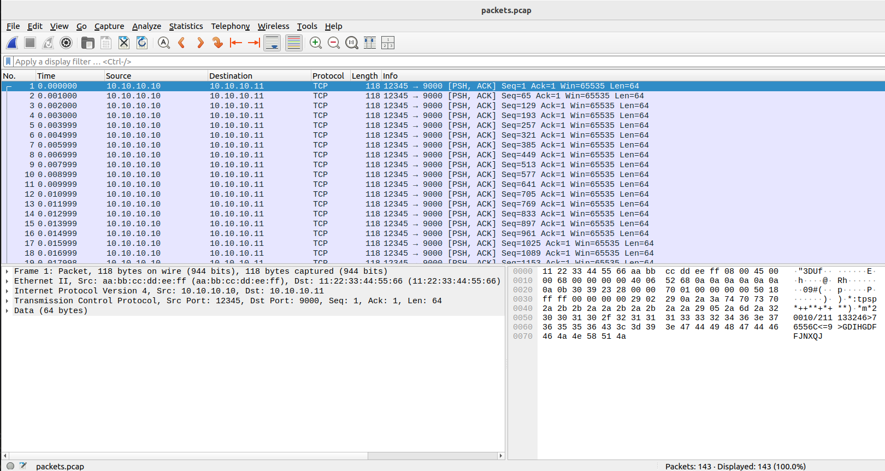
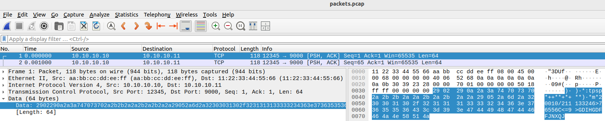
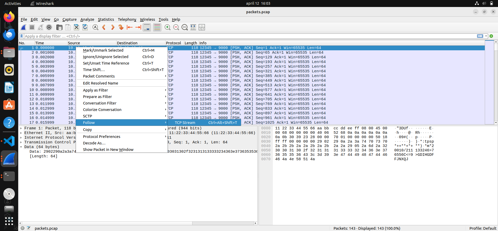
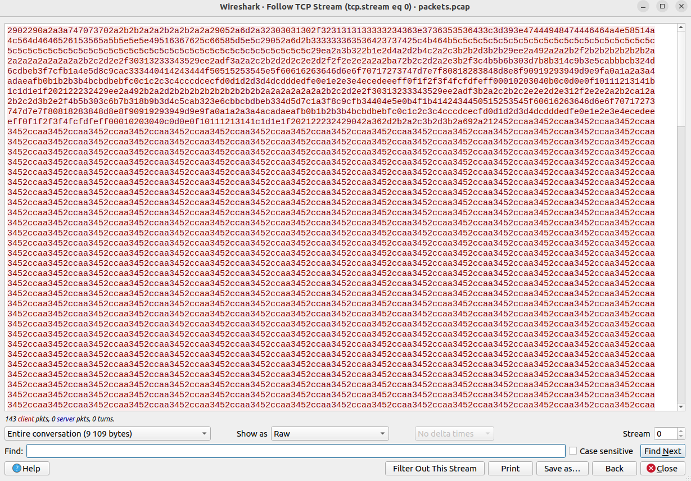
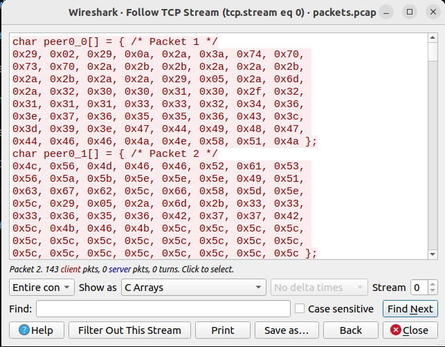

# Write-up Silent Stream

## Challenge

In this challenge, we need to decrypt the content of a file that has been captured by Wireshark while it was being sent to another computer. The encrypted content contains the flag.

### 1. How was the file encrypted?

The challenge provides a python script showing how the file was encrypted.

It used a Caesar cipher, with a % 256 operation to always keep each byte within the range of a valid character.

To reverse the encryption, one must then subtract the cipher from the encrypted byte, also with a % 256 modulo operation to prevent the byte values from going below 0.

Like this:

```cpp
for (int i = 0; i < codedBytesLength; i++)
    codedBytes[i] = (codedBytes[i] - key) % 256;
```

In the script provided by the challenge, the default key number for the encryption is 42, and in main, the function is called without a key value, indicating that the key that was used in the challenge was 42.

### 2. Extracting the captured file content

I had to install Wireshark to be able to read the PCAP file.

I then loaded the file in Wireshark:



The file content is in the data layer of each packet:



Going in each packet to extract the content can be tedious. An easier way is to right click on a packet and select "Follow" and then click on "TCP Stream":



The content of the whole sequence will be displayed:



These are the hex values of each byte in hexadecimal, without spaces. And at this point, the bytes are encrypted.

A more convenient way to copy is to have the data presented as C arrays:



I copied all the arrays, and turned it into one vector of unsigned characters.

### 3. Decrypting the bytes

I then decrypted the bytes and printed the decrypted bytes as characters. I was expecting the flag inside this output.

But I was wrong. The characters that were printed made it feel like the decryption went wrong. Or that I used the wrong key. 

So I even decrypted the bytes with all possible keys: 0 to 255.

On each key, the characters that were printed after decryption made it feel like it did not succeed. 

That was until I noticed these characters at the start of the output, when decrypted with the key 42: `JFIF`.

These characters reminded me of something. And when I looked it up on ChatGPT, it was mentioned that it was related to a .jpg file.

That's when I realized that the decrypted bytes were not for text, it was the bytes of a picture file.

I double checked by making sure that the first bytes matched those hex value:

```
Byte 0-1: FF D8   (SOI)
Byte 2-3: FF E0   (APP0 marker)
```

And they did.

### 4. Creating a picture file out of the decrypted bytes

What I then did was to decrypt all the bytes with the key 42, then print each resulting bytes in hexadecimal format, without spacesc, and wrote it all in one line to an output file `decryptedBytes.txt`.

I then ran this command to reconstruct the image file:

```
xxd -r -p decryptedBytes.txt flag.jpg
```

The picture revealed the flag.

### 5. Recreating the code

I created a script (`decrypt.cpp`) to decrypt the bytes.

I stored the bytes in one big vector in a separate file linked via a header file.